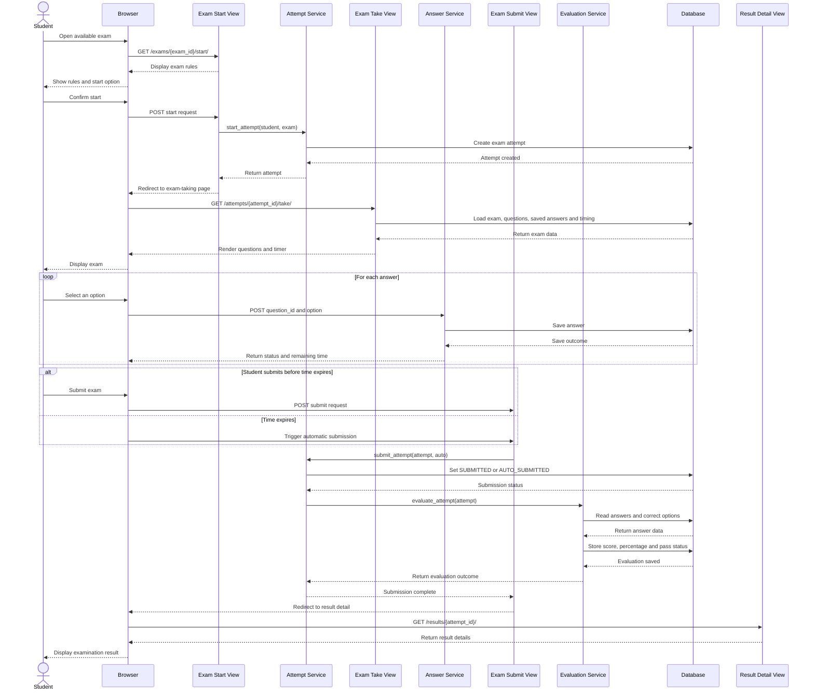

# OEP-66: Take Exam Sequence Diagram

**Status:** Intended design based on the SRS and the current view/service contracts. Exam-taking and evaluation services are still placeholders.

```mermaid
sequenceDiagram
    actor Student
    participant Browser
    participant StartView as Exam Start View
    participant AttemptService as Attempt Service
    participant ExamView as Exam Take View
    participant AnswerService as Answer Service
    participant SubmitView as Exam Submit View
    participant Evaluation as Evaluation Service
    participant DB as Database
    participant ResultView as Result Detail View

    Student->>Browser: Open available exam
    Browser->>StartView: GET /exams/{exam_id}/start/
    StartView-->>Browser: Display exam rules
    Browser-->>Student: Show rules and start option

    Student->>Browser: Confirm start
    Browser->>StartView: POST start request
    StartView->>AttemptService: start_attempt(student, exam)
    AttemptService->>DB: Create exam attempt
    DB-->>AttemptService: Attempt created
    AttemptService-->>StartView: Return attempt
    StartView-->>Browser: Redirect to exam-taking page

    Browser->>ExamView: GET /attempts/{attempt_id}/take/
    ExamView->>DB: Load exam, questions, saved answers and timing
    DB-->>ExamView: Return exam data
    ExamView-->>Browser: Render questions and timer
    Browser-->>Student: Display exam

    loop For each answer
        Student->>Browser: Select an option
        Browser->>AnswerService: POST question_id and option
        AnswerService->>DB: Save answer
        DB-->>AnswerService: Save outcome
        AnswerService-->>Browser: Return status and remaining time
    end

    alt Student submits before time expires
        Student->>Browser: Submit exam
        Browser->>SubmitView: POST submit request
    else Time expires
        Browser->>SubmitView: Trigger automatic submission
    end

    SubmitView->>AttemptService: submit_attempt(attempt, auto)
    AttemptService->>DB: Set SUBMITTED or AUTO_SUBMITTED
    DB-->>AttemptService: Submission status
    AttemptService->>Evaluation: evaluate_attempt(attempt)
    Evaluation->>DB: Read answers and correct options
    DB-->>Evaluation: Return answer data
    Evaluation->>DB: Store score, percentage and pass status
    DB-->>Evaluation: Evaluation saved
    Evaluation-->>AttemptService: Return evaluation outcome
    AttemptService-->>SubmitView: Submission complete
    SubmitView-->>Browser: Redirect to result detail

    Browser->>ResultView: GET /results/{attempt_id}/
    ResultView-->>Browser: Return result details
    Browser-->>Student: Display examination result
```
